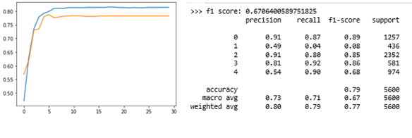

<h1> Sleep-Stage Classification
<h2>Problem Statement</h2>

In this project, we have implemented different machine learning and deep learning algorithms to automatically classify sleep stages i.e, to Wake, N1, N2, N3 and REM on windows of 30 seconds of raw data and compared the results. The dataset source and its characteristics are described below:
Source: https://www.physionet.org/content/sleep-edfx/1.0.0/
The source database contains 197 whole-night PolySomnoGraphic sleep recordings, containing EEG, EOG, chin EMG, and event markers. Some records also contain respiration and body temperature. The *PSG.edf files are whole-night polysmnographic sleep recordings containing EEG (from Fpz-Cz and Pz-Oz electrode locations), EOG (horizontal), submental chin EMG, and an event marker. The *Hypnogram.edf files contain annotations of the sleep patterns that correspond to the PSGs. These patterns (hypnograms) consist of sleep stages W, R, 1, 2, 3, 4, M (Movement time) and ? (not scored). All hypnograms were manually scored by well-trained technician. 
According to the AASM manual (https://aasm.org/clinical-resources/scoring-manual/), sleep EEG consists of 5 stages. Each of the five stages is defined below.

-W: Awake state (stage W) is characterized by alpha or faster frequency bands occupying more than 50% of the epoch, frequent eye movements and high EMG tone.
-N1: Stage N1 is scored when alpha occupies more than 50% of epoch while theta activity, slow rolling eye movements and vertex waves are evident.
-N2: Stage N2 is scored when sleep spindles or K-complexes (less than 3 min apart) are noted.
-N3: Stage N3 is characterized by delta activity detected in over 20% of the epoch length.
-REM: Upon sleep scoring an epoch is marked as REM when saw-tooth waves along with rapid eye movements as well as lowest EMG signals are observed through each epoch.

<h2> Methods </h2>
Learning Process: Sleep Data in terms of EEG → Data Preprocessing based on 30 sec Time frame→ Feature Extraction → 5 stage classification Some of the classification methods that we explored are Random forest, SVM, LTSM (Class of Artificial Neural network).

<h2> Results </h2>
1)	LSTM: Accuracy and classification report was used to evaluate the performance of the model. The below accuracy plot shows for the model executed on 50 subjects for 30 epochs. As seen in the plot there was significant increase in the performance or accuracy of the model. For 151 subjects if we increase the number of epochs we could have achieved higher accuracy, but as the data size for each subject is large enough RAM (Random access memory) didn’t support the execution on all the subjects for more than 25epochs which achieved an accuracy of 61%

  

2)	SVM: Performance of the SVM model increased significantly by using ‘rbf’ (Radial basis function) over ‘linear’ kernel. Accuracy measure, classification report and confusion matrix were used to evaluate the model performance. An accuracy of 60% was achieved by running the model on 50 subjects. 

3)	RF: Metrics evaluation and subjects used in this was model was similar to SVM. An accuracy of 59% was achieved.

Model Comparison
